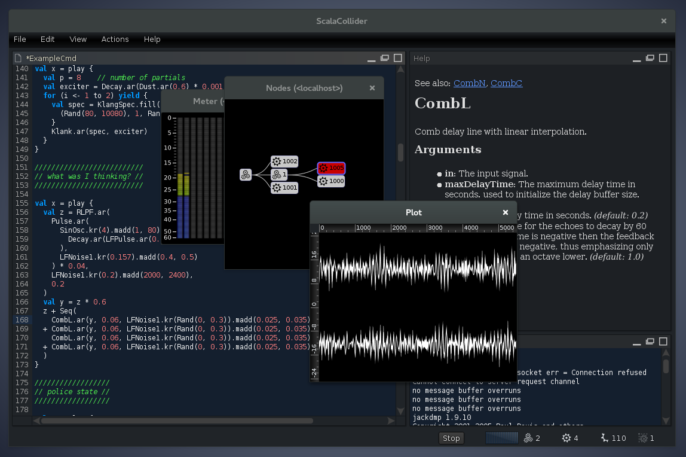

# ScalaCollider-Swing

[](https://gitter.im/Sciss/ScalaCollider?utm_source=badge&utm_medium=badge&utm_campaign=pr-badge&utm_content=badge)
[](https://travis-ci.org/Sciss/ScalaColliderSwing)
[](https://maven-badges.herokuapp.com/maven-central/de.sciss/scalacolliderswing_2.11)

## statement

ScalaCollider-Swing is a Swing GUI front-end for [ScalaCollider](https://git.iem.at/sciss/ScalaCollider). ScalaCollider
is a client for the [SuperCollider](https://supercollider.github.io/) sound synthesis server.

(C)opyright 2008&ndash;2019 by Hanns Holger Rutz. All rights reserved. It is released under
the [GNU General Public License](https://git.iem.at/sciss/ScalaColliderSwing/raw/master/licenses/ScalaColliderSwing-License.txt)
v3+ and comes with absolutely no warranties. To contact the author, send an email to `contact at sciss.de`.

Please see the `licenses` folder for details. It contains the license headers for all dependencies and transitive
dependencies. For the _binary release_ of ScalaCollider-Swing, source code is not included but available via the
respective OSS project pages, as indicated in the license files, or&mdash;in compliance with GPL/LGPL&mdash;on
request via E-Mail. All source code with group-ID `de.sciss` is available from [git.iem.at/sciss](https://git.iem.at/sciss).



## downloading

- A binary (executable) version is provided via [archive.org](https://archive.org/details/ScalaColliderSwing) or
  [GitHub releases](https://github.com/Sciss/ScalaColliderSwing/releases/latest).
  We provide a universal zip for all platforms as well as a dedicated Debian package.
- The source code can be downloaded from [git.iem.at/sciss/ScalaColliderSwing](https://git.iem.at/sciss/ScalaColliderSwing) or 
  [github.com/Sciss/ScalaColliderSwing](http://github.com/Sciss/ScalaColliderSwing).

## building from source

ScalaCollider-Swing compiles against Scala 2.12, 2.11 using [sbt](https://www.scala-sbt.org/).

- `sbt assembly` creates a fully self-contained jar (platform neutral)

To link to ScalaCollider-Swing:

    "de.sciss" %% "scalacolliderswing" % v

Or just to some sub-modules:

    "de.sciss" %% "scalacolliderswing-core"        % v  // only the core library extensions
    "de.sciss" %% "scalacolliderswing-interpreter" % v  // plus the Scala REPL
    "de.sciss" %% "scalacolliderswing-plotting"    % v  // plus plotting functions
    "de.sciss" %% "scalacolliderswing-app"         % v  // plus the desktop IDE

The current version `v` is `"1.41.1"`.

## contributing

Please see the file [CONTRIBUTING.md](CONTRIBUTING.md)

## running

The standalone jar, created via `sbt assembly` produces `ScalaCollider.jar` which is double-clickable and can be
run via:

    $ java -jar ScalaCollider.jar

Runnable packages can be created via `sbt universal:packageBin` (all platforms) or `sbt debian:packageBin` (Debian).

You can also run the "old" multi-window demo using

## documentation

 - There is a small screencast intro at [www.screencast.com/t/YjUwNDZjMT](http://www.screencast.com/t/YjUwNDZjMT)
 - ScalaCollider was also presented at [Scala Days 2012](http://skillsmatter.com/podcast/scala/scalacollider)
 - See the [ScalaCollider](https://git.iem.at/sciss/ScalaCollider) site for mailing-list information, Wiki, and
   additional resources

### GUI commands

The GUI extensions are available by calling the special `.gui` method on supported objects. The extensions are
imported with `import de.sciss.synth.swing.Implicits._`.

```scala

    // server
    s.gui.meter()               // show peak meters for main I/O
    s.gui.tree()                // show node tree for server's root group

    // group
    someGroup.gui.tree()        // show node tree with a given group as root

    // audio-bus
    someBus.gui.meter()         // show peak meters for the given bus
    someBus.gui.waveform(dur)   // record and plot bus output for duration in seconds

    // graph functions
    val fun = graph {           // use `graph { ... }` instead of `play { ... }` to capture function
      PinkNoise.ar
    }
    fun.gui.waveform(dur)       // record and plot graph function for duration in seconds
```

Experimental support for JFreeChart is added (app sub-project only). Extensions are imported
with `import de.sciss.synth.swing.Plotting.Implicits._`.

```scala

    Vector.fill(200)(random).plot()                 // 1D plot, lines
    Vector.fill(100)(random).plot(discrete = true)  // 1D plot, sample-and-hold

    Vector.tabulate(316) { i => (i * 0.003 * 0.2).cos -> (i * 0.025).sin } .plot()  // 2D plot, scatter

    Vector.fill(3)(Vector.fill(100)(random-random).integrate).plot() // multiple 1D plots
```

Chart properties and export to PNG and PDF are available through a context menu.

